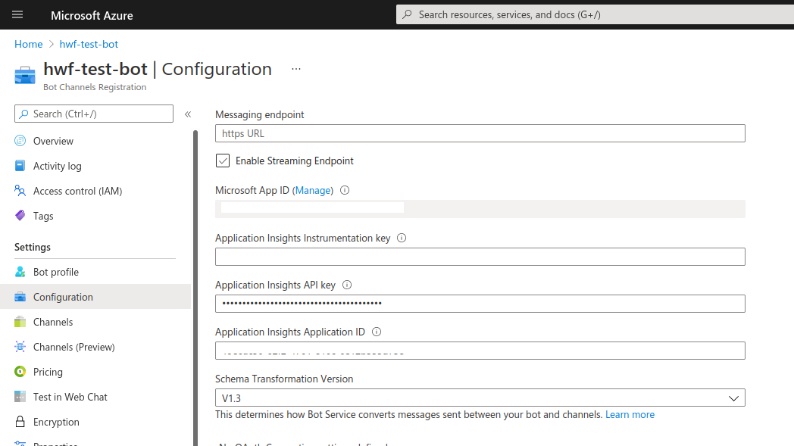
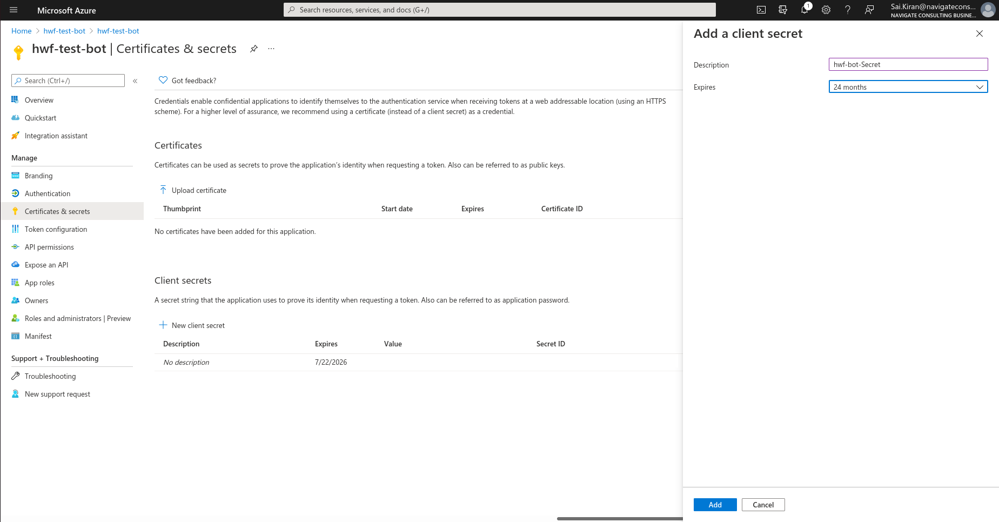
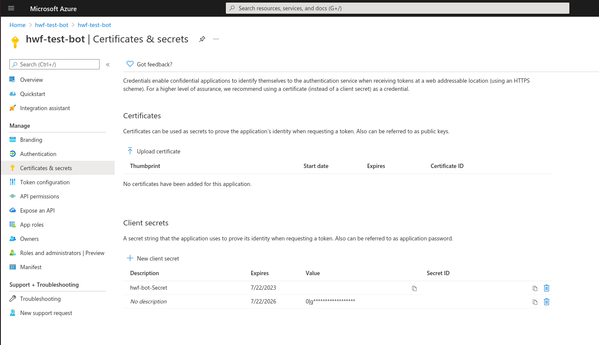

# Channel Configuration - Microsoft Teams 

## Callback URL Configuration

Callback URL - https://domain/bot/teams/{assistant_name}/{token}
- Note - Callback URL needs to be updated in microsoft azure portal against the Bot framework account in use.

## Channel Configuration 

Configuration steps for microsoft 

1. Navigate to Azure Portal and Create a new Bot Framework Account 
 

2. Create bot handle and provide other details.

3. Enable Teams Channel 

   
4. Get App ID and Secret Key

5. Configure Teams channel in HWF chatbot application , 
Reply URl would be of below format 

        https://<domain_name>/bot/teams/<Project_name>/<secret_token>

6. Update the Reply URL on the Teams Bot Framework Account 

## HWF Configuration

Below are the required fields for configuration of Teams channel in HWF. 

- Application ID  - Can be obtained from azure bot framework account
- Tenant ID - Can be obtained from azure bot framework account
- Application Password / Secret Key - Can be obtained from azure bot framework account
- Token - Set a value and use it in callback URL.

## Inbound Message formats 

#### - Text
Regular text messages set to bot are supported. 

#### - Image with caption 
An image sent as attachment to bot with text caption, here the text caption is passed to chatbot as intent
and the image is passed on as attachment to chatbot. 
Image attachment would contain the URL to download the image in attachment secton of the tracker, and can be used in skill / custom action 
to download and process the image.

#### - Attachment with caption

An attachment sent to bot can be processed in custom actions / skills. Attachment URL and other details are stored in attchment
section of the inbound tracker. Also caption needs to be passed along with the attachment so that appropriate intent is triggered. 

## Outbound Message formats 

#### - Text 
HTML Text responses are supported by Teams, for formatting etc please check this [link](https://docs.microsoft.com/en-us/azure/bot-service/rest-api/bot-framework-rest-connector-create-messages?view=azure-bot-service-4.0) 

#### - Buttons 
For static button contents, Buttons field in responses can be used. For more complex usecase use custom field.

#### - Images 
Images can be sent as an HTML content. For better formatting and sizing options Custom type can be used.

#### - Custom 
Teams supports wide range of message types as documented [here](https://docs.microsoft.com/en-us/azure/bot-service/rest-api/bot-framework-rest-connector-add-rich-cards?view=azure-bot-service-4.0). All these custom message types can be used in Custom section of responses.
